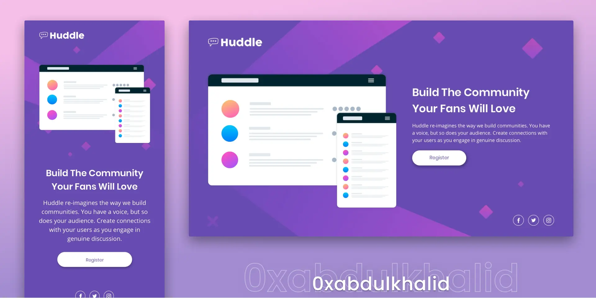
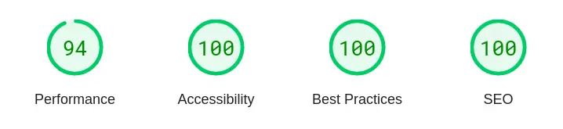

  

  <h2 align="center">Huddle Landing Page with Single Introductory Section Solution</h2>
  

    <a href="https://www.frontendmentor.io/challenges/huddle-landing-page-with-a-single-introductory-section-B_2Wvxgi0" target="_blank"><strong>Frontend Mentor Challenge</strong></a>
     
     
    <a href="https://0xabdulkhalid.github.io/huddle-landing-page-with-single-introductory-section/" target="_blank">View Demo</a>
    &nbsp;·&nbsp;
    <a href="https://github.com/0xabdulkhalid/huddle-landing-page-with-single-introductory-section/issues" target="_blank">Report Bug</a>
    &nbsp;·&nbsp;
    <a href="https://github.com/0xabdulkhalid/huddle-landing-page-with-single-introductory-section/issues" target="_blank">Request Feature</a>
  

<!-- Badges -->

  <!-- Profiles -->
   &nbsp;&nbsp;&nbsp;

  <!-- Status -->
   &nbsp;&nbsp;&nbsp;

  <!-- Difficulty -->
  

 
 

## **Preview**

 

## **Links**

- |||
  | :----- | :----- |
  | Solution URL: | [[ Yet to be posted ⌛ ]](#links) |
  | Live Site URL: | [https://0xabdulkhalid.github.io/huddle-landing-page-with-single-introductory-section/](https://0xabdulkhalid.github.io/huddle-landing-page-with-single-introductory-section/) |
  |||

 

## Pagespeed Insights Score:

- | Scored 99.125% on Pagespeed Insights |
  | :-----: |
  |  |
  |  |
  | Check out [**Pagespeed Insights**](https://pagespeed.web.dev/analysis/https-0xabdulkhalid-github-io-huddle-landing-page-with-single-introductory-section/uksoqtv0ha?form_factor=mobile) to get live score |
  |||

 

## The challenge

- The challenge is to build out this Huddle Landing Page with Single Introductory Section and get it looking as close to the design as possible.

- Your users should be able to: 
  - View the optimal layout for the page depending on their device's screen size
  - See hover states for all interactive elements on the page

 

## **Built With**

  &nbsp;  

 

## **Tools Used**

 &nbsp;  &nbsp;  &nbsp;  &nbsp;  &nbsp;  

 

## **Acknowledgment**

* Challenge was provided by [Frontend Mentor](https://www.frontendmentor.io)

 

## **Let's Connect 👋**

  &nbsp;&nbsp;&nbsp;

   &nbsp;&nbsp;&nbsp;

  

 
